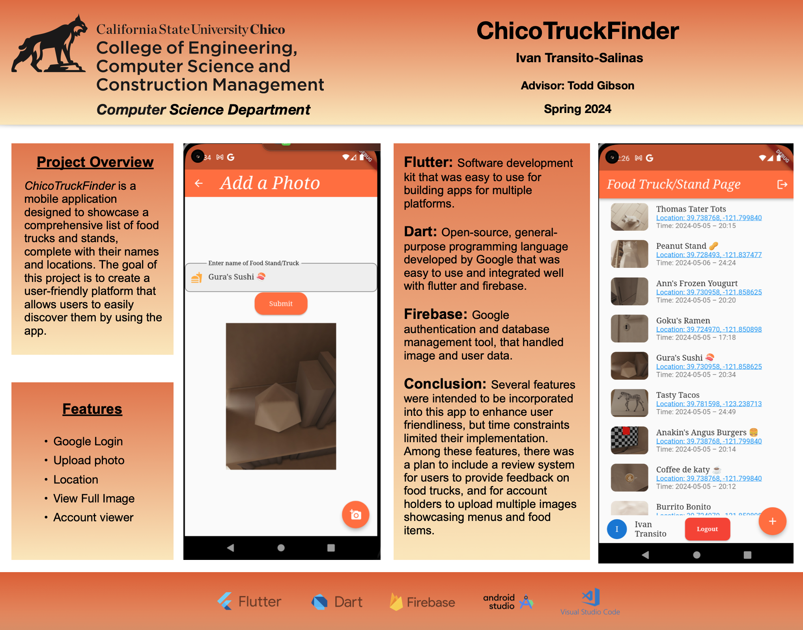

Author: Ivan Transito-Salinas

Description Concept:

I am developing an app to help people discover local food trucks and food stands in their area. 
From my experience, finding new and interesting food stands can be challenging, as they often appear in unexpected locations and at random times.

My app aims to solve this problem by providing a comprehensive directory of local food trucks. Users can browse pictures, read reviews, check locations, and view hours of operation.

Additionally, food truck owners can easily add their trucks to the app, allowing them to reach more customers and grow their businesses. 
This platform will not only help people find delicious new food options but also support local food truck owners by giving them greater visibility in the community.

